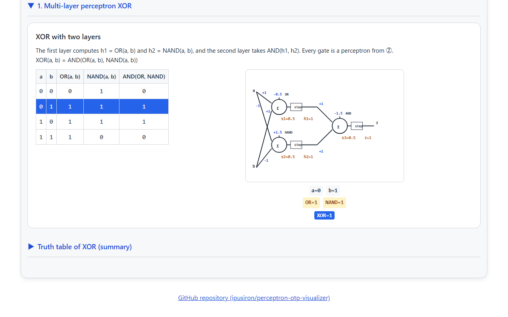
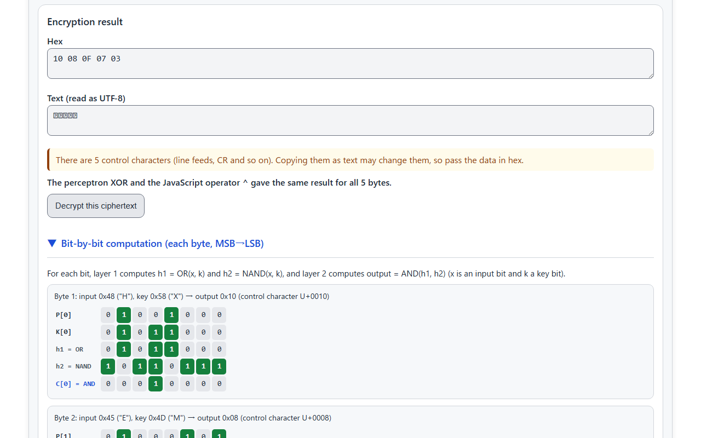
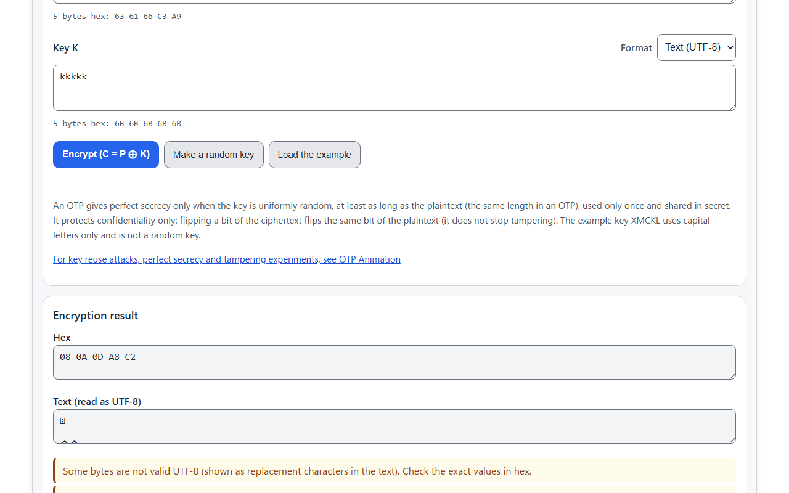
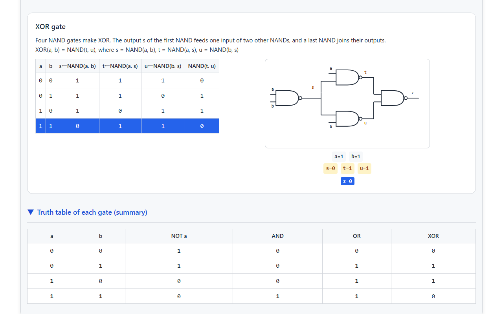
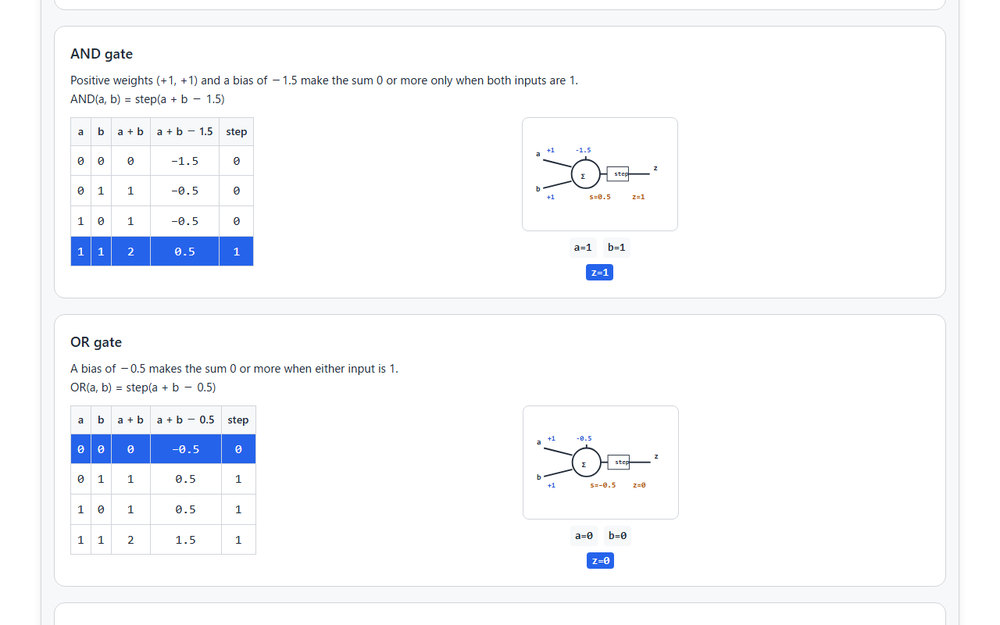
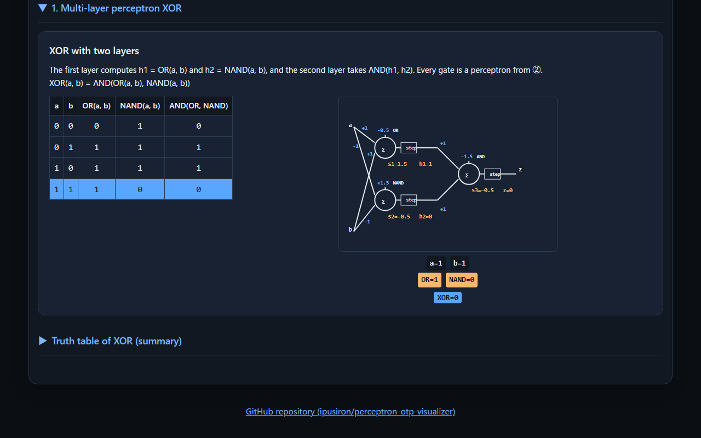
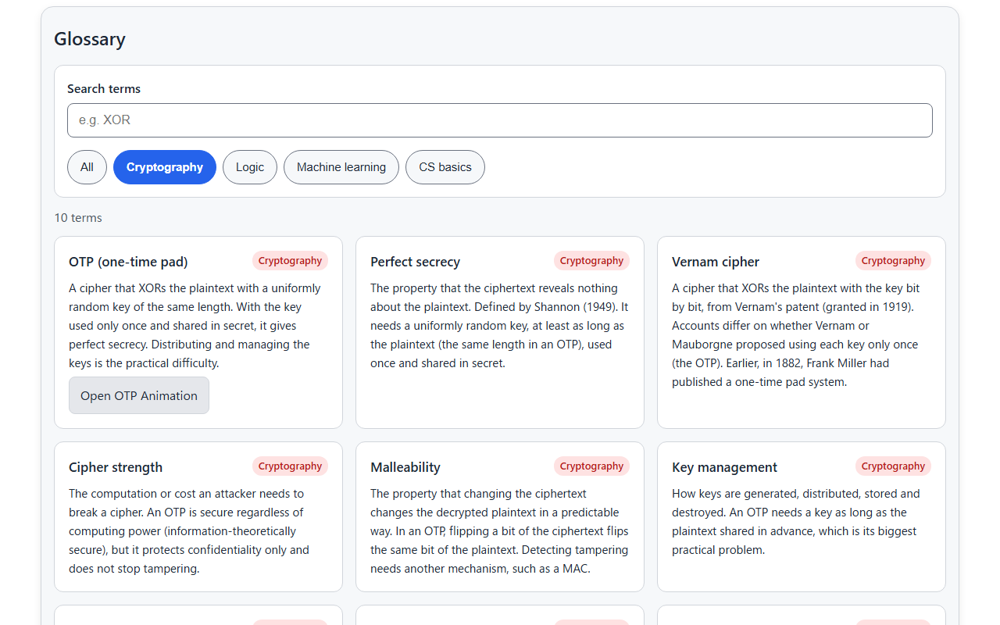

English · [日本語](README.md)

# Perceptron OTP Visualizer - Perceptron-based OTP Encryption Visualizer


[](https://ipusiron.github.io/perceptron-otp-visualizer/)

**Day057 - 100 Security Tools with Generative AI**

Perceptron OTP Visualizer is an educational visualization tool that connects logic circuits, machine learning and cryptography. It builds logic gates from NAND gates only, builds the same gates with perceptrons (artificial neurons), and builds XOR, which a single layer cannot make, with two layers. Finally it uses that XOR to encrypt and decrypt with a one-time pad (OTP) and shows the computation bit by bit.

In each tab, selecting a row of a truth table updates the values in the circuit and perceptron diagrams. Everything is computed in the browser; the text and keys you enter are never sent anywhere.

---

## 🌐 Demo

👉 **[https://ipusiron.github.io/perceptron-otp-visualizer/](https://ipusiron.github.io/perceptron-otp-visualizer/)**

You can try it directly in your browser.

---

## 📸 Screenshots

>
>
>*Building XOR with a two-layer perceptron (OR and NAND in layer 1, AND in layer 2; row a=0, b=1)*

>
>
>*Encrypting HELLO with the key XMCKL using the perceptron XOR (ciphertext 10 08 0F 07 03; bit-by-bit computation)*

>
>
>*Encrypting café with the key kkkkk gives bytes that are not valid UTF-8 and control characters, so the ciphertext is passed in hex*

>
>
>*XOR from four NAND gates (row a=1, b=1) and the summary truth table of each gate*

>
>
>*AND with a single-layer perceptron (weights +1 and +1, bias −1.5; row a=1, b=1)*

>
>
>*Dark mode (two-layer XOR, row a=1, b=1)*

>
>
>*Glossary (filtered to cryptography)*

---

## ✨ Features

### ① NAND universality

- Circuit diagrams and truth tables that build NOT, AND, OR and XOR from NAND gates only (1, 2, 3 and 4 NAND gates)
- Selecting a row of a table updates the inputs, intermediate values and output of the circuit (click, or Enter, Space and the up/down arrow keys)
- A summary truth table of each gate

### ② Perceptron gates

- NOT, AND, OR and NAND as single-layer perceptrons (one threshold unit each), with diagrams of the weights, bias and step function
- Each table row shows the weighted sum plus bias and the output of the step function
- An explanation of why only XOR cannot be made by a single layer (it is not linearly separable)

### ③ Perceptron XOR

- A diagram of the two-layer perceptron that takes OR and NAND in layer 1 and AND in layer 2 (with the sum and output of each neuron)
- The summary truth table puts the two-layer output next to the JavaScript operator `^`
- A Python implementation and decision-boundary plots are in a Jupyter notebook (`notebooks/`)

### ④ Perceptron OTP

- Encrypts and decrypts with a one-time pad by applying the two-layer XOR from ③ to each of the 8 bits of every byte (all output is computed by the perceptron and checked against the operator `^` for every byte)
- The input and the key can be text (UTF-8) or hex. The ciphertext can be passed to decryption in hex ("Decrypt this ciphertext")
- A button that makes a random key with `crypto.getRandomValues`, with the same number of bytes as the plaintext
- When the output has bytes that are not valid UTF-8 or control characters, the tool warns that copying it as text breaks it
- The bit-by-bit computation (input, key, h1 = OR, h2 = NAND, output = AND) for the first 16 bytes, including which character and which byte of it each byte is
- A speed comparison of the operator `^` and the perceptron XOR (time per byte)

### ⑤ Glossary

- 28 terms in cryptography, logic, machine learning and CS basics. Search by keyword and filter by field
- Definitions are checked against primary sources (Shannon's paper, HAC, textbooks, OEIS and others)

### Whole page

- Japanese and English (also `?lang=ja` and `?lang=en`)
- Light and dark mode (follows the OS setting at first)
- On phones, the diagrams come below the tables

---

## 📖 How to use

1. Open the [demo page](https://ipusiron.github.io/perceptron-otp-visualizer/).
2. Go through the tabs from ①. Selecting a row of the table in each card updates the values in the diagram on the right (below on phones).
3. In ②, see how the weights and bias of a single-layer perceptron turn into a logic gate.
4. In ③, see how the outputs of OR and NAND in layer 1 go into AND in layer 2 and make XOR.
5. In ④, press "Load the example" and then "Encrypt". The ciphertext (hex) and the bit-by-bit computation appear.
6. Press "Decrypt this ciphertext" to make the ciphertext (hex) and the key the decryption input. "Decrypt" restores the original plaintext.
7. To try your own text, enter the plaintext and press "Make a random key".
8. Look up the terms you met in the ⑤ glossary.

---

## 🔑 One-time pad conditions

A one-time pad XORs the plaintext with a key of the same length, bit by bit. Shannon (1949) defined perfect secrecy, the property that the ciphertext reveals nothing about the plaintext, and showed that it needs at least as many keys as plaintexts and that the Vernam system (the one-time pad) achieves it.

It is perfectly secret only when all of the following hold:

- The key is uniformly random
- The key is at least as long as the plaintext (the same length in a one-time pad)
- The key is used only once
- The key is shared in secret

**One-time pads are rarely used in practice because of key distribution, not slow computation.** A key as long as the plaintext must be shared securely in advance, and HAC (Handbook of Applied Cryptography) names the difficulty of key distribution and key management as the drawback.

It also protects confidentiality only. Flipping a bit of the ciphertext flips the same bit of the decrypted plaintext (it does not stop tampering). Key reuse attacks, perfect secrecy and tampering can be tried in [OTP Animation](https://ipusiron.github.io/otp-animation/) from the same series.

The example key `XMCKL` in this tool uses capital letters only and is not a random key. It is there to follow the computation.

---

## 🎯 Use cases

### Learning and teaching

- In an information class or a logic-circuit lecture, the teacher selects rows in ① to show that XOR can be built from NAND alone. Students can follow the number of NAND gates (1, 2, 3 and 4) and the intermediate values
- In an introduction to machine learning, read the weights and biases in ② and see that "weighted sum + bias → step function" becomes a gate. In ③, see that XOR, which one layer cannot make, can be made with two
- In an introduction to security, use the bit-by-bit computation in ④ to see that XOR makes encryption and decryption the same computation ((P ⊕ K) ⊕ K = P). Learn the danger of key reuse together with OTP Animation
- For self-study, put the notebook (Python) next to the page and compare the same gates made with different weights

### At work

- Programmers outside security can see the difference between strings and bytes. As with the ciphertext of café, data with bytes that are not valid UTF-8 or a CR breaks when copied as text
- In training or internal study sessions, show the speed comparison as an example of "the same result, very different speed depending on the implementation" (times depend on the device)
- In talks and workshops, show the steps one by one to a non-specialist audience as an entry point to both AI and cryptography

### Daily life, hobbies and research

- In electronics, before building XOR from one IC with four NAND gates (such as the 74HC00), check the wiring and intermediate values with the circuit and truth table in ①
- When making puzzles and riddles, design tricks with the "same key restores it" property of XOR and make hex ciphertexts and keys (with the random key button)
- In CTF practice, get used to handling XOR ciphertexts in hex
- For research, check the conventions for the value of the step function at 0, linear separability and the conditions of perfect secrecy against the primary sources in the references

### Combining with other tools

- [OTP Animation](https://ipusiron.github.io/otp-animation/): experiments on key reuse attacks (crib dragging), perfect secrecy and tampering
- `notebooks/logic_gate_of_perceptron.ipynb` in this repository: build the same gates in Python and plot the decision boundaries ([open in Google Colab](https://colab.research.google.com/github/ipusiron/perceptron-otp-visualizer/blob/main/notebooks/logic_gate_of_perceptron.ipynb))

The author intends this as a tool for learning and understanding and does not encourage misuse.

---

## 🔬 Technical notes

### Files

- `js/potp-core.js`: the computation (no DOM). NAND gates, single-layer perceptrons, two-layer XOR, byte XOR, hex parsing, UTF-8 checks, random keys and the speed comparison
- `js/app.js`: the page (tabs, table rows, OTP input and output, bit view, glossary)
- `js/messages.js`: Japanese and English text and the glossary order
- `js/i18n.js`, `js/theme.js` and `js/theme-init.js`: language and theme switching

### Perceptron weights

The output is step(weighted sum + bias), where the step function is 1 for 0 or more and 0 for negative values (the value at 0 differs between texts: 0, 1/2 or 1; this tool uses 1).

| Gate | Weights | Bias | Formula |
|---|---|---|---|
| NOT | -1 | 0.5 | step(-a + 0.5) |
| AND | 1, 1 | -1.5 | step(a + b - 1.5) |
| OR | 1, 1 | -0.5 | step(a + b - 0.5) |
| NAND | -1, -1 | 1.5 | step(-a - b + 1.5) |

There are 16 two-input logical functions, and a single-layer perceptron (a threshold function) can express 14 of them (OEIS A000609). The two it cannot express are XOR and XNOR.

### Gates from NAND

| Gate | NAND gates | Formula |
|---|---|---|
| NOT | 1 | NAND(a, a) |
| AND | 2 | NAND(t, t), where t = NAND(a, b) |
| OR | 3 | NAND(NAND(a, a), NAND(b, b)) |
| XOR | 4 | NAND(NAND(a, s), NAND(b, s)), where s = NAND(a, b) |

### Two-layer XOR

| a | b | h1 = OR(a, b) | h2 = NAND(a, b) | output = AND(h1, h2) | a ^ b |
|---|---|---|---|---|---|
| 0 | 0 | 0 | 1 | 0 | 0 |
| 0 | 1 | 1 | 1 | 1 | 1 |
| 1 | 0 | 1 | 1 | 1 | 1 |
| 1 | 1 | 1 | 0 | 0 | 0 |

### One-time pad example

| | Text | Hex |
|---|---|---|
| Plaintext P | HELLO | 48 45 4C 4C 4F |
| Key K | XMCKL | 58 4D 43 4B 4C |
| Ciphertext C = P ⊕ K | (control characters only) | 10 08 0F 07 03 |

Ciphertexts contain bytes of 0x80 or more and control characters. For example, encrypting `café` (`63 61 66 C3 A9`) with the key `kkkkk` gives `08 0A 0D A8 C2`, which contains a CR (`0D`) and `A8 C2`, which are not valid UTF-8. A CR turns into an LF when pasted into an input field, and invalid bytes become replacement characters (U+FFFD), so a ciphertext copied as text cannot be decrypted back. That is why this tool passes ciphertexts in hex.

### Perceptron XOR versus the operator ^

| Item | XOR with the operator ^ | Perceptron XOR |
|---|---|---|
| Per bit | One XOR | Weighted sums and step functions of three neurons (OR, NAND, AND) |
| Result | The same | The same (checked for every byte) |
| Speed | Fast | Slow (hundreds of times slower or more in our measurements) |
| Key preparation | Share a random key as long as the plaintext in advance | The same |
| Security | Perfect secrecy if the key conditions hold | The same (it does not depend on how the XOR is computed) |
| What you learn | XOR and cryptography | XOR and cryptography, plus the link between logic circuits and neural networks |

### How the speed is measured

The XOR of two random 10,000-byte inputs is repeated for at least 0.1 seconds per method, and the time is divided by the repetitions and the number of bytes. The resolution of `performance.now()` is 0.1 ms in Chromium and 1 ms in Firefox and Safari (without cross-origin isolation, as on GitHub Pages), so a single measurement can come out as 0 ms. In our measurements in October 2026, the perceptron XOR took about 500 to 1,500 times as long as the operator `^` (Chromium, Edge, Firefox).

---

## 🔒 Security

- The CSP is set in a meta element and limited to `default-src 'self'` and friends (`script-src 'self'`, `style-src 'self'`, `connect-src 'none'` and so on). There are no inline scripts, style attributes or event handlers
- No external scripts (CDN) are loaded, including math-rendering libraries
- The page does not communicate with anything (`connect-src 'none'`, no fetch). The text and keys you enter never leave the browser and are not saved (only the language and theme choices are saved)
- Random keys are made with `crypto.getRandomValues`
- The page writes with `textContent` and does not use `innerHTML`
- `<meta name="referrer" content="no-referrer">`, and external links use `rel="noopener noreferrer"`
- GitHub Pages cannot set custom response headers. frame-ancestors does not work in a meta CSP and neither does X-Frame-Options, so embedding in other sites cannot be prevented

---

## ⚠️ Notes and limitations

- This is an educational tool. The perceptron weights are set by hand and are not learned
- Random keys come from a cryptographically secure generator, but that does not solve the practical difficulty of a one-time pad (key distribution and management)
- The example key `XMCKL` is not a random key
- Each input is limited to 65,536 bytes, and the bit-by-bit computation shows the first 16 bytes
- The speed comparison depends on the device, the browser and the load at the time
- The text output field cannot show control characters and invalid bytes correctly. Check the exact values in hex

---

## 🧪 Tests

```bash
npm test
```

- Runs with `node --test` on Node.js 22 or later. There are no dependencies
- GitHub Actions runs the tests on every push and pull request
- The tests check the computation (gates, perceptrons, XOR for all 256×256 byte pairs, hex, UTF-8, round trips), the HTML (CSP, tab structure, table values, diagram weights), the text (Japanese/English keys, writing rules), the colors (contrast), the formatting, and the tables and examples in the READMEs

---

## 🔗 References

- C. E. Shannon, "Communication Theory of Secrecy Systems", Bell System Technical Journal 28(4), 656–715, 1949
- A. J. Menezes, P. C. van Oorschot, S. A. Vanstone, Handbook of Applied Cryptography, CRC Press, 1996 (§1.5.4, §6.1.1) [https://cacr.uwaterloo.ca/hac/](https://cacr.uwaterloo.ca/hac/)
- D. Boneh, V. Shoup, A Graduate Course in Applied Cryptography, Version 0.6, 2023 (Definition 2.1, Theorem 2.5) [https://toc.cryptobook.us/](https://toc.cryptobook.us/)
- G. S. Vernam, "Secret Signaling System", US Patent 1,310,719, 1919
- S. M. Bellovin, "Frank Miller: Inventor of the One-Time Pad", Cryptologia 35(3), 203–222, 2011
- F. Rosenblatt, "The perceptron: A probabilistic model for information storage and organization in the brain", Psychological Review 65(6), 386–408, 1958
- W. S. McCulloch, W. Pitts, "A logical calculus of the ideas immanent in nervous activity", Bulletin of Mathematical Biophysics 5(4), 115–133, 1943
- M. Minsky, S. Papert, Perceptrons, MIT Press, 1969
- A. B. J. Novikoff, "On convergence proofs on perceptrons", Symposium on the Mathematical Theory of Automata 12, 615–622, 1962
- H. M. Sheffer, "A set of five independent postulates for Boolean algebras, with application to logical constants", Transactions of the American Mathematical Society 14(4), 481–488, 1913
- OEIS A000609, Number of threshold functions of n or fewer variables [https://oeis.org/A000609](https://oeis.org/A000609)
- W3C, ARIA Authoring Practices Guide, Tabs Pattern [https://www.w3.org/WAI/ARIA/apg/patterns/tabs/](https://www.w3.org/WAI/ARIA/apg/patterns/tabs/)
- Yoshinao Mori, Python 3-nensei Deep Learning no Shikumi (in Japanese), Shoeisha, 2023 (the source of the notebook code)

---

## 🔄 Planned extensions

- An animation that trains a two-layer network by backpropagation
- A view that draws decision boundaries on the input plane
- An experiment where you move the weights and bias yourself

---

## 📁 Directory structure

```text
perceptron-otp-visualizer/
├── .github/                            # GitHub settings
│   └── workflows/                      # GitHub Actions workflows
│       └── test.yml                    # Runs npm test on push and pull request
├── assets/                             # README screenshots
│   ├── en/                             # Screenshots of the English page
│   │   ├── screenshot.png              # Two-layer XOR
│   │   ├── screenshot2.png             # Encrypting HELLO and the bit view
│   │   ├── screenshot3.png             # Encrypting café (passed in hex)
│   │   ├── screenshot4.png             # XOR from four NAND gates
│   │   ├── screenshot5.png             # AND with a single-layer perceptron
│   │   ├── screenshot6.png             # Dark mode
│   │   └── screenshot7.png             # Glossary
│   ├── screenshot.png                  # Two-layer XOR (Japanese page)
│   ├── screenshot2.png                 # Encrypting HELLO and the bit view (Japanese page)
│   ├── screenshot3.png                 # Encrypting café (Japanese page)
│   ├── screenshot4.png                 # XOR from four NAND gates (Japanese page)
│   ├── screenshot5.png                 # AND with a perceptron (Japanese page)
│   ├── screenshot6.png                 # Dark mode (Japanese page)
│   └── screenshot7.png                 # Glossary (Japanese page)
├── js/                                 # Page and computation scripts
│   ├── app.js                          # The page (tabs, tables, OTP, glossary)
│   ├── i18n.js                         # Language choice and static text
│   ├── messages.js                     # Japanese and English text, glossary order
│   ├── potp-core.js                    # Computation (gates, perceptrons, XOR, hex, UTF-8)
│   ├── theme-init.js                   # Applies the saved theme before drawing
│   └── theme.js                        # Light/dark toggle
├── notebooks/                          # Supplementary material
│   └── logic_gate_of_perceptron.ipynb  # Perceptron gates and decision boundaries in Python
├── test/                               # node --test tests
│   ├── contrast.test.js                # Color contrast
│   ├── core.test.js                    # Computation
│   ├── format.test.js                  # Line length, line endings, control characters
│   ├── html.test.js                    # index.html (CSP, tabs, tables, diagrams)
│   ├── i18n.test.js                    # Language detection
│   ├── load.js                         # Loads the page scripts into the tests
│   ├── messages.test.js                # Text (keys, writing rules, facts)
│   └── readme.test.js                  # README tables, examples and structure
├── .gitignore                          # Files Git does not track
├── .nojekyll                           # No Jekyll on GitHub Pages
├── CLAUDE.md                           # Project notes for Claude Code
├── LICENSE                             # MIT license
├── README.en.md                        # English README (this file)
├── README.md                           # Japanese README
├── index.html                          # The page (five tabs)
├── package.json                        # npm test settings (no dependencies)
└── style.css                           # Colors (light/dark) and layout
```

---

## 💻 Requirements

- A recent Chrome, Edge, Firefox or Safari (desktop and phones)
- Opening `index.html` directly in the browser (`file://`) works. To use a local server, run `python -m http.server 8000` and open `http://localhost:8000/`
- Tests need Node.js 22 or later

---

## 📄 License

MIT License - see [LICENSE](LICENSE) for details.

---

## 🛠️ About this tool

This tool was developed as part of the "100 Security Tools with Generative AI" project.
The project builds and publishes a wide range of security-related tools over 100 days with the help of AI.

For details of the project and the other tools, see the following page.

🔗 [https://akademeia.info/?page_id=42163](https://akademeia.info/?page_id=42163)
