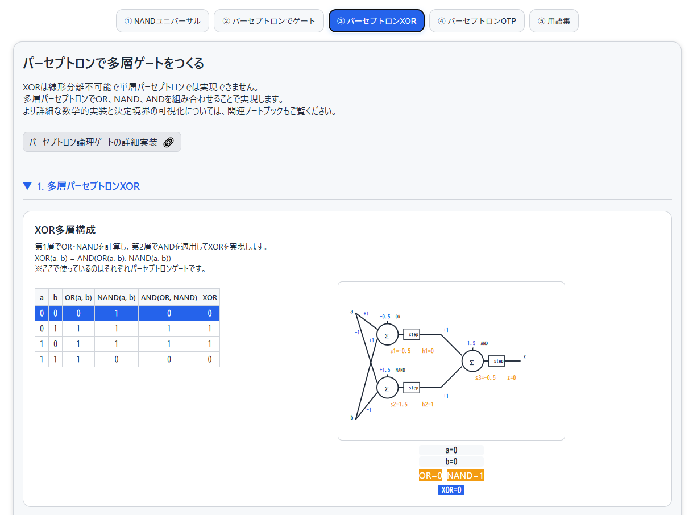

<!--
---
title: Perceptron OTP Visualizer
category: genai
difficulty: 3
description: Educational tool visualizing NAND gate universality, perceptron implementations, multi-layer XOR, and OTP encryption through interactive demonstrations.
tags: [nand, perceptron, xor, otp, cryptography, education, neural-networks]
demo: https://ipusiron.github.io/perceptron-otp-visualizer/
---
-->

# Perceptron OTP Visualizer - パーセプトロンOTP可視化ツール


[](https://ipusiron.github.io/perceptron-otp-visualizer/)

**Day057 - 生成AIで作るセキュリティツール100**

**Perceptron OTP Visualizer**は、論理回路・機械学習・暗号学の橋渡しを目指す教育用可視化ツールです。NANDゲートの普遍性から始まり、パーセプトロンによる論理ゲート実装、多層化によるXOR実現、そしてワンタイムパッド（OTP）暗号までを段階的に学習できます。

各ステップでインタラクティブな真理値表、回路図、パーセプトロン図を組み合わせ、抽象的な概念を視覚的に理解できるよう設計されています。

---

## 🌐 デモページ

👉 **[https://ipusiron.github.io/perceptron-otp-visualizer/](https://ipusiron.github.io/perceptron-otp-visualizer/)**

ブラウザーで直接お試しいただけます。

---

## 📸 スクリーンショット

>
>
>*2階層でパーセプトロンXORを作る*

---

## 📝 概要

本ツールは、**段階的学習**と**インタラクティブ可視化**による教育ツールです。  
以下の学習段階を提供します：

1. **NANDゲートの普遍性**: NOT、AND、OR、XORをNANDゲートのみで構成
2. **単層パーセプトロン**: 基本論理ゲートをニューロンで実現
3. **多層パーセプトロン**: 線形分離不可能なXORを多層化で解決
4. **OTP暗号応用**: XORベースの暗号化・復号化を体験
5. **用語集**: 関連概念の包括的な説明

---

## 🎮 機能一覧

### タブ1: NANDで基本ゲートをつくる
- **インタラクティブ回路図**: クリック可能な真理値表と連動する回路可視化
- **段階的構成**: NOT → AND → OR → XORの順序で複雑性を増加
- **リアルタイム更新**: 入力パターンに応じて回路の値が動的に変化

### タブ2: パーセプトロンで基本ゲートをつくる
- **ニューロン可視化**: 重み、バイアス、活性化関数を含むパーセプトロン図
- **計算過程表示**: 重み付き入力の総和からstep関数適用までを段階表示
- **独立インタラクション**: 各ゲートの真理値表を個別にクリック可能

### タブ3: パーセプトロンで多層ゲートをつくる
- **多層構造可視化**: 第1層（OR・NAND）と第2層（AND）の2層構成
- **XOR実現の解説**: 線形分離不可能問題を多層化で解決する過程を明示
- **詳細実装リンク**: Jupyter Notebookへの外部リンクで補完学習

### タブ4: パーセプトロンOTP（暗号化）
- **暗号化・復号化**: UTF-8テキストでの実用的な暗号化体験
- **ビット単位可視化**: MSB→LSBでの詳細なXOR演算過程
- **性能比較**: ネイティブXORとパーセプトロンXORの処理速度比較
- **セキュリティ評価**: OTPの完全秘匿性条件と実用性の解説

### タブ5: 用語集
- **体系的分類**: 暗号、CS基礎、論理、機械学習の4カテゴリ
- **外部リンク**: 関連ツール（OTP Animation）への統合
- **検索機能**: カテゴリフィルターによる効率的な用語検索

---

## ⚙️ 技術仕様

### 実装技術
- **フロントエンド**: バニラJavaScript（ES6+）
- **数式描画**: MathJax v3
- **スタイリング**: CSS Grid/Flexbox、CSS カスタムプロパティ
- **レスポンシブ**: モバイル・デスクトップ両対応

### パーセプトロン仕様
- **活性化関数**: ステップ関数 `step(z) = {1 if z ≥ 0, 0 if z < 0}`
- **重み設定**:
  - NOT: `y = step(-a + 0.5)`
  - AND: `y = step(a + b - 1.5)`
  - OR: `y = step(a + b - 0.5)`
  - NAND: `y = step(-a - b + 1.5)`

### 暗号化仕様
- **文字エンコーディング**: UTF-8
- **ビット順序**: MSB→LSB
- **鍵要件**: 平文と同じバイト長
- **エラー処理**: 鍵長不一致時の警告表示

---

## 🎯 ターゲット層

- **情報セキュリティ初学者**: XORやワンタイムパッドの基礎理解
- **コンピューターサイエンス学生**: 論理回路とニューラルネットワークの関連性
- **機械学習学習者**: 線形分離可能性と多層化の必要性
- **教育者**: 授業やワークショップでのデモ教材
- **CTF参加者**: XOR暗号の理解深化

---

## 🚀 活用シナリオ

### 1. 教育現場でのデモ教材
- 情報工学・暗号学入門での実演ツール
- 抽象的概念の視覚的・体験的学習

### 2. CTFトレーニング補助
- XOR・OTP問題の理解促進
- 鍵長一致の重要性確認

### 3. 自主学習・研究支援
- 論理回路・機械学習・暗号の接点探究
- 性能比較実験

### 4. 講演・ワークショップ
- セキュリティ・AI講演での視覚的デモ
- 専門外聴衆への分かりやすい説明

---

## 📚 補完教材

### Jupyter Notebook
[](https://colab.research.google.com/github/ipusiron/perceptron-otp-visualizer/blob/main/notebooks/logic_gate_of_perceptron.ipynb)
[](https://github.com/ipusiron/perceptron-otp-visualizer/blob/main/notebooks/logic_gate_of_perceptron.ipynb)

**内容**: 数学的実装詳細、決定境界可視化、Pythonコード例

### 関連ツール
- **[OTP Animation](https://ipusiron.github.io/otp-animation/)**: OTPの基礎学習用アニメーション

---

## 🔒 セキュリティ対策

GitHub Pages公開にあたり実施したセキュリティ対策：

### Content Security Policy (CSP)
- XSS攻撃防止のため外部スクリプトを制限
- 信頼できるCDN（jsDelivr）のみ許可

### セキュリティヘッダー
- **X-Content-Type-Options**: MIME type sniffing攻撃防止
- **X-Frame-Options**: クリックジャッキング攻撃防止  
- **Referrer-Policy**: リファラー情報漏洩制限

### 外部リンク保護
- 全外部リンクに `rel="noopener noreferrer"` 設定
- Tabnabbing攻撃・リファラー漏洩防止

### リソース検証
- MathJax CDNにSubresource Integrity適用
- スクリプト改ざん検出

---

## 🛠 使い方

1. **[GitHub Pagesデモ](https://ipusiron.github.io/perceptron-otp-visualizer/)** にアクセス
2. **段階的学習**: タブ1→2→3→4の順序で進める
3. **インタラクション**: 真理値表をクリックして回路図を確認
4. **実践**: タブ4で実際の暗号化・復号化を体験
5. **深掘り**: 用語集や外部リンクで知識を拡張

---

## 📂 ディレクトリー構成

```
perceptron-otp-visualizer/
├── assets/
│   └── screenshot.png          # アプリケーションのスクリーンショット
├── data/
│   └── words.json              # 用語集データ（JSON形式）
├── notebooks/
│   └── logic_gate_of_perceptron.ipynb  # 補完学習用Jupyterノートブック
├── .claude/
│   └── settings.local.json     # Claude Code設定ファイル
├── index.html                  # メインHTMLファイル
├── script.js                   # JavaScriptロジック
├── style.css                   # スタイルシート
├── CLAUDE.md                   # Claude Code用プロジェクト仕様
├── README.md                   # プロジェクト説明（このファイル）
├── LICENSE                     # MITライセンス
├── .gitignore                  # Git除外設定
└── .nojekyll                   # GitHub Pages設定
```

---

## 🔄 今後の拡張予定

- **学習アルゴリズム可視化**: 誤差逆伝播法のアニメーション
- **決定境界表示**: 2D平面での線形分離可能性可視化  
- **性能ベンチマーク**: 文字列長別の処理速度比較
- **マルチバイト対応**: 絵文字・結合文字の詳細ハンドリング
- **カスタム重み設定**: ユーザーが重みを調整可能な実験モード

---

## 📄 ライセンス

MIT License – 詳細は [LICENSE](LICENSE) を参照してください。

---

## 🛠 このツールについて
本ツールは、「生成AIで作るセキュリティツール100」プロジェクトの一環として開発されました。
このプロジェクトでは、AIの支援を活用しながら、セキュリティに関連するさまざまなツールを100日間にわたり制作・公開していく取り組みを行っています。

プロジェクトの詳細や他のツールについては、以下のページをご覧ください。

🔗 [https://akademeia.info/?page_id=42163](https://akademeia.info/?page_id=42163)
