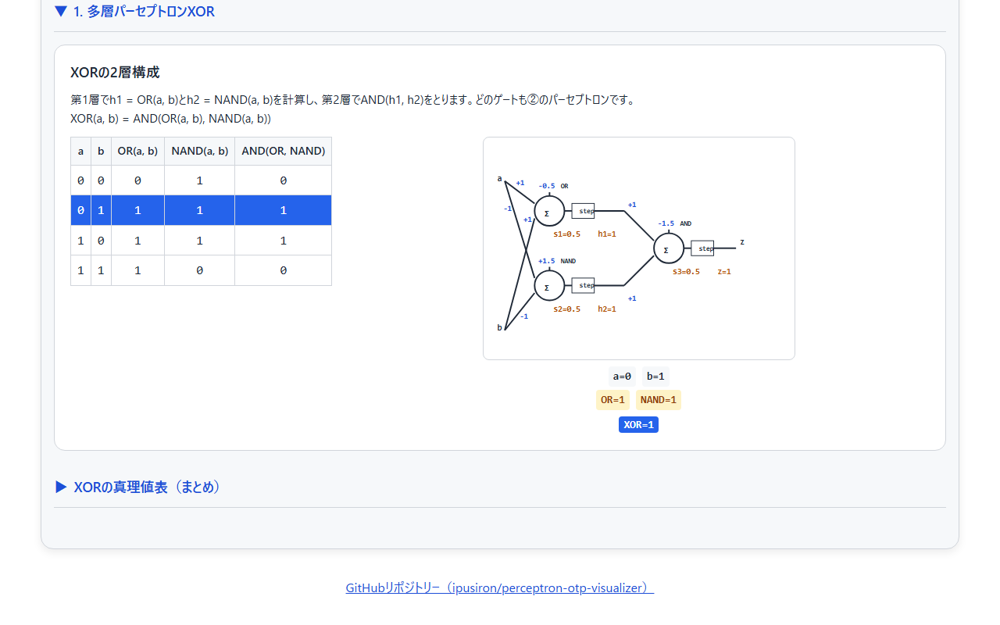
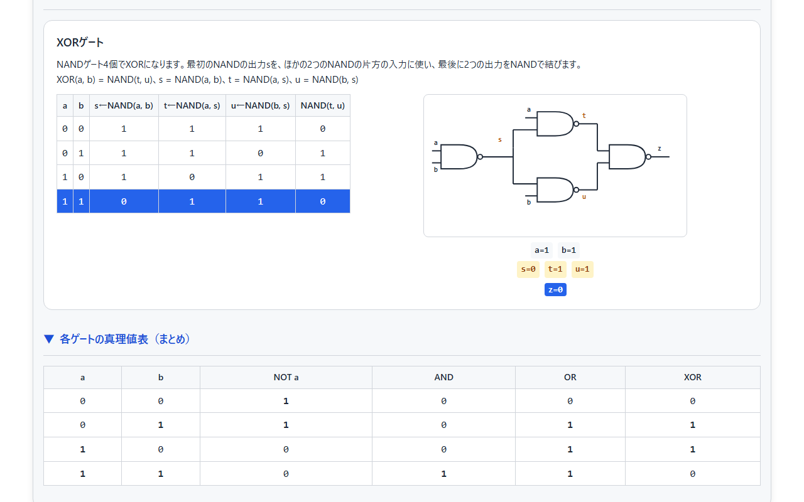
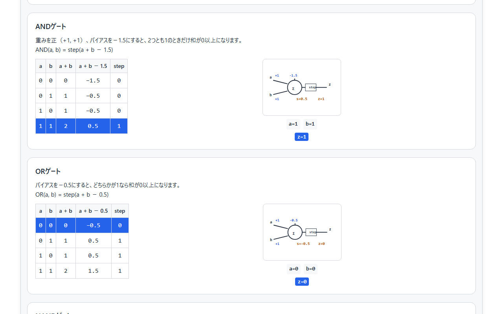
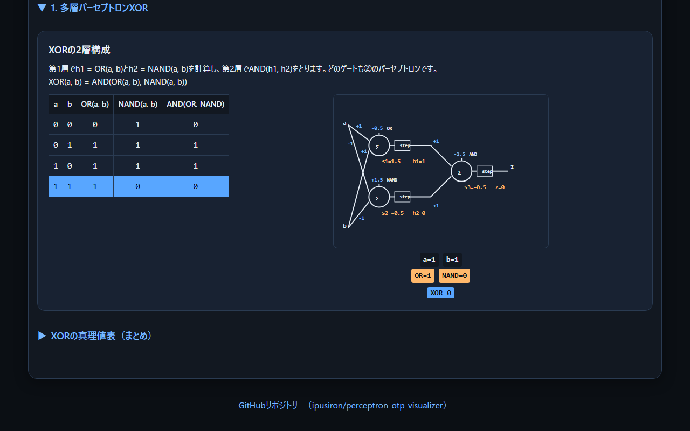

<!--
---
id: day057
slug: perceptron-otp-visualizer

title: "Perceptron OTP Visualizer"

subtitle_ja: "パーセプトロンOTP可視化ツール"
subtitle_en: "Perceptron-based OTP Encryption Visualizer"

description_ja: "NANDゲートの普遍性、パーセプトロンによる論理ゲート実装、多層XOR、OTP暗号をインタラクティブに可視化する教育ツール"
description_en: "Educational tool visualizing NAND gate universality, perceptron implementations, multi-layer XOR, and OTP encryption through interactive demonstrations"

category_ja:
  - 機械学習
  - 現代暗号
category_en:
  - Machine Learning
  - Modern Cryptography

difficulty: 3

tags:
  - nand
  - perceptron
  - xor
  - otp
  - cryptography
  - neural-networks
  - visualization
  - education

repo_url: "https://github.com/ipusiron/perceptron-otp-visualizer"
demo_url: "https://ipusiron.github.io/perceptron-otp-visualizer/"

hub: true
---
-->

[English](README.en.md) · 日本語

# Perceptron OTP Visualizer - パーセプトロンOTP可視化ツール


[](https://ipusiron.github.io/perceptron-otp-visualizer/)

**Day057 - 生成AIで作るセキュリティツール100**

Perceptron OTP Visualizerは、論理回路・機械学習・暗号をひとつながりで学ぶ教育用の可視化ツールです。NANDゲートだけで論理ゲートを組み、同じゲートをパーセプトロン（人工ニューロン）で作り、単層では作れないXORを2層で作ります。最後に、そのXORでワンタイムパッド（OTP）の暗号化と復号をして、ビットごとの計算を見せます。

各タブで、真理値表の行を選ぶと回路図とパーセプトロンの図の値が変わります。計算はすべてブラウザーの中で行い、入力した文字や鍵を外へ送りません。

---

## 🌐 デモページ

👉 **[https://ipusiron.github.io/perceptron-otp-visualizer/](https://ipusiron.github.io/perceptron-otp-visualizer/)**

ブラウザーで直接お試しいただけます。

---

## 📸 スクリーンショット

>
>
>*2層のパーセプトロンでXORを作る（第1層でORとNAND、第2層でAND。a=0、b=1の行）*

>
>
>*パーセプトロンのXORで、HELLOを鍵XMCKLで暗号化する（暗号文は10 08 0F 07 03。ビットごとの計算）*

>
>
>*caféを鍵kkkkkで暗号化すると、UTF-8として読めないバイトと制御文字を含む。暗号文は16進数で受け渡す*

>
>
>*NANDゲート4個でXORを組む（a=1、b=1の行）と、各ゲートの真理値表のまとめ*

>
>
>*単層パーセプトロンのAND（重み+1・+1、バイアス−1.5。a=1、b=1の行）*

>
>
>*ダークモード（2層のXOR、a=1、b=1の行）*

>
>
>*用語集（暗号の分野で絞り込み）*

---

## ✨ 機能

### ① NANDユニバーサル

- NANDゲートだけでNOT・AND・OR・XORを組む回路図と真理値表（NANDの個数は1・2・3・4個）
- 表の行を選ぶと、回路の入力・途中の値・出力が変わる（クリック、またはEnterキー・スペースキー・上下の矢印キー）
- 各ゲートの真理値表のまとめ

### ② パーセプトロンでゲート

- 単層パーセプトロン（しきい値素子1個）のNOT・AND・OR・NANDを、重み・バイアス・ステップ関数の図で示す
- 表の各行で、重み付きの和にバイアスを足した値と、ステップ関数の出力を並べる
- XORだけは単層で作れない理由（線形分離できない）の説明

### ③ パーセプトロンXOR

- 第1層でORとNAND、第2層でANDをとる2層のパーセプトロンの図（各ニューロンの総和と出力の値つき）
- 真理値表のまとめで、2層の出力とJavaScriptの演算子`^`を並べて比べる
- Python版の実装と決定境界の図はJupyter Notebook（`notebooks/`）

### ④ パーセプトロンOTP

- ③の2層のXORを各バイトの8ビットに使って、ワンタイムパッドの暗号化と復号をする（出力はすべてパーセプトロンで計算し、全バイトを演算子`^`の結果と突き合わせて表示する）
- 入力と鍵の形式を、テキスト（UTF-8）と16進数で切り替えられる。暗号文は16進数のまま復号へ渡せる（「この暗号文を復号する」）
- 乱数の鍵を作るボタン（`crypto.getRandomValues`で、平文と同じバイト数）
- 出力にUTF-8として読めないバイトや制御文字があれば、テキストでコピーすると壊れることを知らせる
- ビットごとの計算（入力・鍵・h1＝OR・h2＝NAND・出力＝AND）を先頭の16バイトまで表示。各バイトがどの文字の何バイト目かも示す
- 演算子`^`とパーセプトロンのXORの速度の比較（1バイトあたりの時間）

### ⑤ 用語集

- 暗号・論理・機械学習・CS基礎の28語。キーワードで探し、分野で絞り込める
- 定義は一次資料（Shannonの論文、HAC、教科書、OEISなど）で確かめた内容にしている

### 画面全体

- 日本語と英語の切り替え（`?lang=ja`・`?lang=en`でも指定できる）
- ライトモードとダークモード（最初はOSの設定に従う）
- スマートフォンでは、表の下に図を置く

---

## 📖 使い方

1. [デモページ](https://ipusiron.github.io/perceptron-otp-visualizer/)を開きます。
2. ①から順に進めます。各カードの表の行を選ぶと、右（スマートフォンでは下）の図の値が変わります。
3. ②で、単層パーセプトロンの重みとバイアスが論理ゲートになる様子を確かめます。
4. ③で、第1層のORとNANDの出力が第2層のANDに入り、XORになることを確かめます。
5. ④で「例を入れる」を押し、「暗号化する」を押します。暗号文（16進数）とビットごとの計算が出ます。
6. 「この暗号文を復号する」を押すと、暗号文（16進数）と鍵が復号の入力になります。「復号する」で元の平文に戻ります。
7. 自分の文で試すときは、平文を入れてから「乱数の鍵を作る」を押します。
8. ⑤の用語集で、出てきた言葉を確かめます。

---

## 🔑 ワンタイムパッドの条件

ワンタイムパッドは、平文と同じ長さの鍵をビットごとにXORする暗号です。Shannon（1949年）は、暗号文を見ても平文について何もわからない性質を完全秘匿と定義し、完全秘匿には鍵の数が平文の数以上必要であること、Vernam方式（ワンタイムパッド）がこれを満たすことを示しました。

完全秘匿になるのは、次の条件がそろったときだけです。

- 鍵が一様な乱数である
- 鍵が平文以上の長さである（ワンタイムパッドでは同じ長さ）
- 鍵を一度だけ使う
- 鍵を秘密に共有している

**ワンタイムパッドが実用で使われにくいのは、計算の遅さではなく鍵の配送のためです。**平文と同じ長さの鍵を事前に安全に共有する必要があり、HAC（Handbook of Applied Cryptography）も、鍵の配送と管理が難しくなる点を欠点に挙げています。

また、守れるのは機密性だけです。暗号文のあるビットを反転すると、復号した平文の同じビットが反転します（改ざんは防げない）。鍵を使い回したときの解読・完全秘匿・改ざんの実験は、同じシリーズの[OTP Animation](https://ipusiron.github.io/otp-animation/)で試せます。

このツールの例の鍵`XMCKL`は英大文字だけで、乱数の鍵ではありません。計算の流れを追うための例です。

---

## 🎯 ユースケース

### 学ぶ・教える

- 情報の授業や論理回路の講義で、先生が①の表の行を選びながら、NANDだけでXORが組めることを見せる。生徒はNANDの個数（1・2・3・4個）と途中の値を追える
- 機械学習の入門で、②の重みとバイアスを読み、「重み付きの和＋バイアス→ステップ関数」がゲートになることを確かめる。③で、単層では作れないXORが2層で作れることを見る
- セキュリティの入門で、④のビットごとの計算から、XORが暗号化と復号で同じ計算になること（(P ⊕ K) ⊕ K = P）を確かめる。鍵の使い回しの危険はOTP Animationとあわせて学ぶ
- 自習で、ノートブック（Python）と画面を並べ、同じゲートを別の重みで作れることを比べる

### 仕事に使う

- セキュリティ以外のプログラマーが、文字列とバイト列の違いを確かめる。caféの暗号文のように、UTF-8として読めないバイトやCRを含むデータは、テキストでコピーすると壊れることを目で見られる
- 研修や社内勉強会で、「同じ結果でも実装によって速さが大きく違う」例として速度の比較を見せる（時間は端末で変わる）
- 講演やワークショップで、AIと暗号の両方の入り口として、専門外の聞き手に段階を追って見せる

### 暮らし・趣味・研究

- 電子工作で、NANDゲート4個入りのIC（74HC00など）1個でXORを組む前に、①の回路図と真理値表で配線と途中の値を確かめる
- 謎解きやパズルの制作で、XORの「同じ鍵で戻る」性質を使った仕掛けを考え、16進数の暗号文と鍵を作る（乱数の鍵を作るボタンを使う）
- CTFの練習で、XORの暗号文を16進数で扱う感覚をつかむ
- 調べものや研究で、ステップ関数の0での値の流儀、線形分離、完全秘匿の条件を、参考文献の一次資料とあわせて確かめる

### ほかのツールと組み合わせる

- [OTP Animation](https://ipusiron.github.io/otp-animation/)：鍵の使い回しの解読（クリブ・ドラッグ）・完全秘匿・改ざんの実験
- このリポジトリーの`notebooks/logic_gate_of_perceptron.ipynb`：Pythonで同じゲートを作り、決定境界を図にする（[Google Colabで開く](https://colab.research.google.com/github/ipusiron/perceptron-otp-visualizer/blob/main/notebooks/logic_gate_of_perceptron.ipynb)）

作者の意図は、学習と理解のための道具です。悪用は勧めません。

---

## 🔬 技術的な説明

### ファイルの役割

- `js/potp-core.js`：計算部（DOMを使わない）。NANDで組むゲート、単層パーセプトロン、2層のXOR、バイト列のXOR、16進数の読み取り、UTF-8の判定、乱数の鍵、速度の比較
- `js/app.js`：画面の処理（タブ、表の行の選択、OTPの入出力、ビットの図、用語集）
- `js/messages.js`：日本語と英語の文言、用語集の並び
- `js/i18n.js`・`js/theme.js`・`js/theme-init.js`：言語とテーマの切り替え

### パーセプトロンの重み

出力はstep(重み付きの和＋バイアス)で、ステップ関数は0以上で1、0未満で0です（0のときの値は文献によって0・1/2・1と分かれ、このツールは1）。

| ゲート | 重み | バイアス | 式 |
|---|---|---|---|
| NOT | -1 | 0.5 | step(-a + 0.5) |
| AND | 1, 1 | -1.5 | step(a + b - 1.5) |
| OR | 1, 1 | -0.5 | step(a + b - 0.5) |
| NAND | -1, -1 | 1.5 | step(-a - b + 1.5) |

2入力の論理関数は16個あり、単層パーセプトロン（しきい値関数）で表せるのはそのうち14個です（OEIS A000609）。表せないのはXORとXNORの2つです。

### NANDで組むゲート

| ゲート | NANDの個数 | 式 |
|---|---|---|
| NOT | 1 | NAND(a, a) |
| AND | 2 | NAND(t, t)、t = NAND(a, b) |
| OR | 3 | NAND(NAND(a, a), NAND(b, b)) |
| XOR | 4 | NAND(NAND(a, s), NAND(b, s))、s = NAND(a, b) |

### 2層のXOR

| a | b | h1 = OR(a, b) | h2 = NAND(a, b) | 出力 = AND(h1, h2) | a ^ b |
|---|---|---|---|---|---|
| 0 | 0 | 0 | 1 | 0 | 0 |
| 0 | 1 | 1 | 1 | 1 | 1 |
| 1 | 0 | 1 | 1 | 1 | 1 |
| 1 | 1 | 1 | 0 | 0 | 0 |

### ワンタイムパッドの計算の例

| | テキスト | 16進数 |
|---|---|---|
| 平文P | HELLO | 48 45 4C 4C 4F |
| 鍵K | XMCKL | 58 4D 43 4B 4C |
| 暗号文C = P ⊕ K | （制御文字だけ） | 10 08 0F 07 03 |

暗号文には0x80以上のバイトや制御文字が出ます。たとえば`café`（`63 61 66 C3 A9`）を鍵`kkkkk`で暗号化すると`08 0A 0D A8 C2`になり、CR（`0D`）と、UTF-8として読めない`A8 C2`を含みます。CRは入力欄に貼るとLFに変わり、読めないバイトは置換文字（U+FFFD）になるので、テキストでコピーした暗号文からは元に戻りません。そのため、このツールは暗号文を16進数で受け渡します。

### パーセプトロンのXORと演算子^の違い

| 項目 | 演算子^のXOR | パーセプトロンのXOR |
|---|---|---|
| 1ビットの計算 | XORを1回 | ニューロン3個（OR・NAND・AND）の重み付きの和とステップ関数 |
| 結果 | 同じ | 同じ（全バイトで突き合わせて確かめる） |
| 速さ | 速い | 遅い（手元の計測では数百倍以上） |
| 鍵の準備 | 平文と同じ長さの乱数の鍵を事前に共有する | 同じ |
| 安全性 | 鍵の条件を満たせば完全秘匿 | 同じ（計算の方法によらない） |
| 学べること | XORと暗号 | XORと暗号に加えて、論理回路とニューラルネットのつながり |

### 速度の比較の測り方

10,000バイトの乱数どうしのXORを、それぞれ0.1秒以上くり返し、かかった時間を回数とバイト数で割ります。`performance.now()`の刻みは、Chromiumで0.1ms、Firefox・Safariで1ms（クロスオリジン分離をしていない場合。GitHub Pagesはこの状態）なので、1回だけ測ると0msになることがあります。2026年10月の手元の計測では、パーセプトロンのXORは演算子`^`の約500〜1,500倍の時間がかかりました（Chromium・Edge・Firefox）。

---

## 🔒 セキュリティ

- CSPはmeta要素で`default-src 'self'`系に限っています（`script-src 'self'`・`style-src 'self'`・`connect-src 'none'`など）。インラインのスクリプト・style属性・イベントハンドラーはありません
- 外部のスクリプト（CDN）を読みません。数式の表示のライブラリーも使っていません
- 外と通信しません（`connect-src 'none'`、fetchを使わない）。入力した文字と鍵はブラウザーの外へ出ず、保存もしません（保存するのは言語とテーマの選択だけ）
- 乱数の鍵は`crypto.getRandomValues`で作ります
- 画面への書き込みは`textContent`で行い、`innerHTML`を使いません
- `<meta name="referrer" content="no-referrer">`、外部へのリンクは`rel="noopener noreferrer"`
- GitHub Pagesでは独自のレスポンスヘッダーを設定できません。meta要素のCSPではframe-ancestorsが効かず、X-Frame-Optionsもmeta要素では効かないので、ほかのサイトへの埋め込みは防げません

---

## ⚠️ 注意と限界

- 教育用のツールです。パーセプトロンの重みは手で決めた値で、学習はしません
- 乱数の鍵は暗号論的に安全な乱数で作りますが、ワンタイムパッドの実用上の難しさ（鍵の配送と管理）は解決しません
- 例の鍵`XMCKL`は乱数の鍵ではありません
- 1回に扱えるのは65,536バイトまでで、ビットごとの計算は先頭の16バイトまで表示します
- 速度の比較の時間は、端末・ブラウザー・そのときの負荷で変わります
- 出力のテキストの欄は、制御文字や読めないバイトを正しく表せません。正確な値は16進数で確かめてください

---

## 🧪 テスト

```bash
npm test
```

- Node.js 22以上の`node --test`で動きます。依存パッケージはありません
- GitHub Actionsで、pushとpull requestのたびに自動で実行します
- 計算部（ゲート・パーセプトロン・256×256の全組のXOR・16進数・UTF-8・往復）、HTML（CSP・タブの形・表の値・図の重み）、文言（日英のキー・表記）、配色（コントラスト）、書式、READMEの表と例を検査します

---

## 🔗 参考文献

- C. E. Shannon, "Communication Theory of Secrecy Systems", Bell System Technical Journal 28(4), 656–715, 1949
- A. J. Menezes, P. C. van Oorschot, S. A. Vanstone, Handbook of Applied Cryptography, CRC Press, 1996（§1.5.4、§6.1.1）[https://cacr.uwaterloo.ca/hac/](https://cacr.uwaterloo.ca/hac/)
- D. Boneh, V. Shoup, A Graduate Course in Applied Cryptography, Version 0.6, 2023（定義2.1、定理2.5）[https://toc.cryptobook.us/](https://toc.cryptobook.us/)
- G. S. Vernam, "Secret Signaling System", US Patent 1,310,719, 1919
- S. M. Bellovin, "Frank Miller: Inventor of the One-Time Pad", Cryptologia 35(3), 203–222, 2011
- F. Rosenblatt, "The perceptron: A probabilistic model for information storage and organization in the brain", Psychological Review 65(6), 386–408, 1958
- W. S. McCulloch, W. Pitts, "A logical calculus of the ideas immanent in nervous activity", Bulletin of Mathematical Biophysics 5(4), 115–133, 1943
- M. Minsky, S. Papert, Perceptrons, MIT Press, 1969
- A. B. J. Novikoff, "On convergence proofs on perceptrons", Symposium on the Mathematical Theory of Automata 12, 615–622, 1962
- H. M. Sheffer, "A set of five independent postulates for Boolean algebras, with application to logical constants", Transactions of the American Mathematical Society 14(4), 481–488, 1913
- OEIS A000609, Number of threshold functions of n or fewer variables [https://oeis.org/A000609](https://oeis.org/A000609)
- W3C, ARIA Authoring Practices Guide, Tabs Pattern [https://www.w3.org/WAI/ARIA/apg/patterns/tabs/](https://www.w3.org/WAI/ARIA/apg/patterns/tabs/)
- 森巧尚『Python 3年生 ディープラーニングのしくみ』翔泳社、2023年（ノートブックのコードの元）

---

## 🔄 今後の拡張予定

- 誤差逆伝播法で2層のネットワークを学習させるアニメーション
- 入力の平面に決定境界を描く表示
- 重みとバイアスを自分で動かす実験

---

## 📁 ディレクトリー構造

```text
perceptron-otp-visualizer/
├── .github/                            # GitHubの設定
│   └── workflows/                      # GitHub Actionsのワークフロー
│       └── test.yml                    # pushとpull requestでnpm testを実行
├── assets/                             # READMEのスクリーンショット
│   ├── en/                             # 英語の画面のスクリーンショット
│   │   ├── screenshot.png              # 2層のXOR
│   │   ├── screenshot2.png             # HELLOの暗号化とビットごとの計算
│   │   ├── screenshot3.png             # caféの暗号化（16進数で受け渡す）
│   │   ├── screenshot4.png             # NAND4個のXOR
│   │   ├── screenshot5.png             # 単層パーセプトロンのAND
│   │   ├── screenshot6.png             # ダークモード
│   │   └── screenshot7.png             # 用語集
│   ├── screenshot.png                  # 2層のXOR
│   ├── screenshot2.png                 # HELLOの暗号化とビットごとの計算
│   ├── screenshot3.png                 # caféの暗号化（16進数で受け渡す）
│   ├── screenshot4.png                 # NAND4個のXOR
│   ├── screenshot5.png                 # 単層パーセプトロンのAND
│   ├── screenshot6.png                 # ダークモード
│   └── screenshot7.png                 # 用語集
├── js/                                 # 画面と計算のスクリプト
│   ├── app.js                          # 画面の処理（タブ・表・OTP・用語集）
│   ├── i18n.js                         # 言語の選択と静的な文言の差し替え
│   ├── messages.js                     # 日本語と英語の文言、用語集の並び
│   ├── potp-core.js                    # 計算部（ゲート・パーセプトロン・XOR・16進数・UTF-8）
│   ├── theme-init.js                   # 描画の前に保存したテーマを当てる
│   └── theme.js                        # ライト・ダークの切り替え
├── notebooks/                          # 補完教材
│   └── logic_gate_of_perceptron.ipynb  # Pythonでパーセプトロンのゲートと決定境界
├── test/                               # node --testのテスト
│   ├── contrast.test.js                # 配色のコントラスト
│   ├── core.test.js                    # 計算部
│   ├── format.test.js                  # 行の長さ・改行・制御文字
│   ├── html.test.js                    # index.htmlの検査（CSP・タブ・表・図）
│   ├── i18n.test.js                    # 言語の決め方
│   ├── load.js                         # 画面のスクリプトをテストに読み込む
│   ├── messages.test.js                # 文言（日英のキー・表記・事実）
│   └── readme.test.js                  # READMEの表・例・構造
├── .gitignore                          # Gitで管理しないファイル
├── .nojekyll                           # GitHub PagesでJekyllを使わない
├── CLAUDE.md                           # Claude Code用のプロジェクトの説明
├── LICENSE                             # MITライセンス
├── README.en.md                        # 英語のREADME
├── README.md                           # 日本語のREADME（このファイル）
├── index.html                          # 画面（5つのタブ）
├── package.json                        # npm testの設定（依存なし）
└── style.css                           # 配色（ライト・ダーク）とレイアウト
```

---

## 💻 動作環境

- 新しめのChrome・Edge・Firefox・Safari（デスクトップとスマートフォン）
- `index.html`をブラウザーで直接開いても（`file://`）動きます。ローカルのサーバーで開く場合は`python -m http.server 8000`のあと`http://localhost:8000/`を開きます
- テストはNode.js 22以上

---

## 📄 ライセンス

MIT License - 詳細は[LICENSE](LICENSE)を参照してください。

---

## 🛠️ このツールについて

本ツールは、「生成AIで作るセキュリティツール100」プロジェクトの一環として開発されました。
このプロジェクトでは、AIの支援を活用しながら、セキュリティに関連するさまざまなツールを100日間にわたり制作・公開していく取り組みを行っています。

プロジェクトの詳細や他のツールについては、以下のページをご覧ください。

🔗 [https://akademeia.info/?page_id=42163](https://akademeia.info/?page_id=42163)
